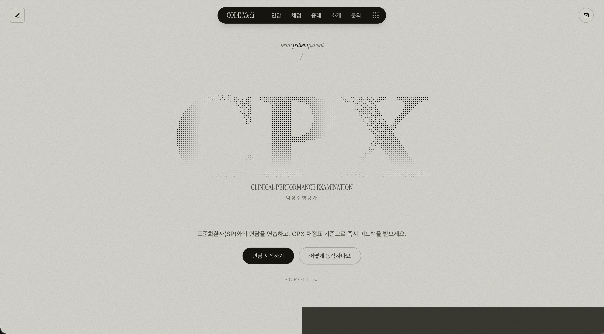
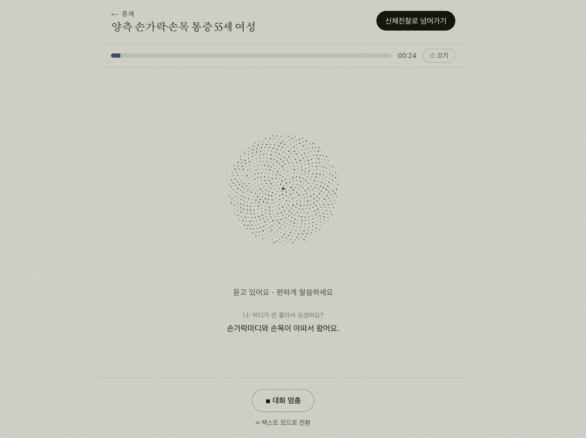
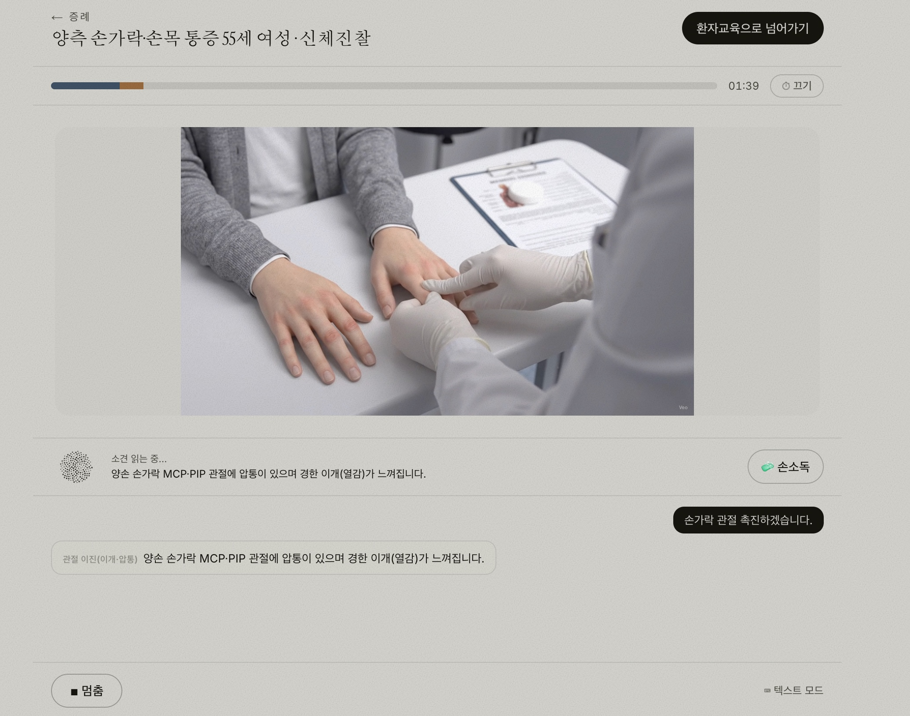
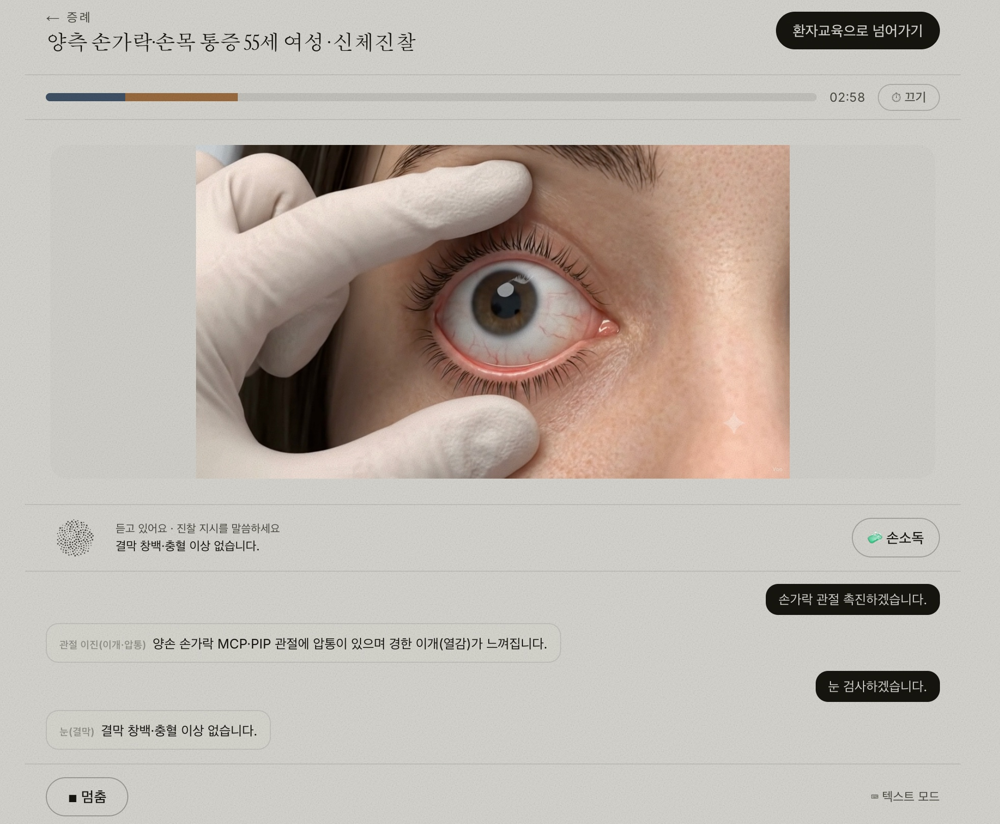
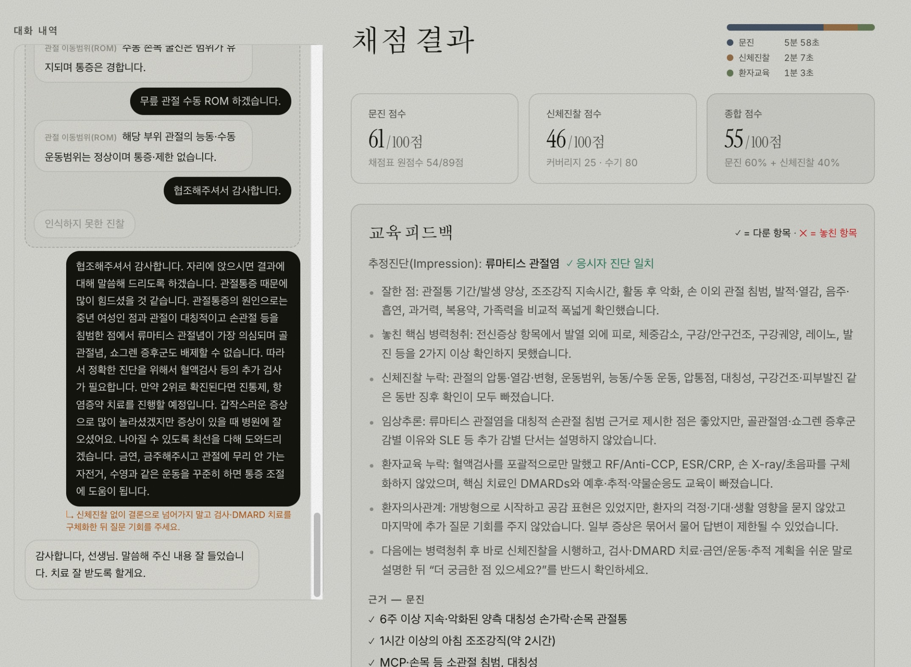
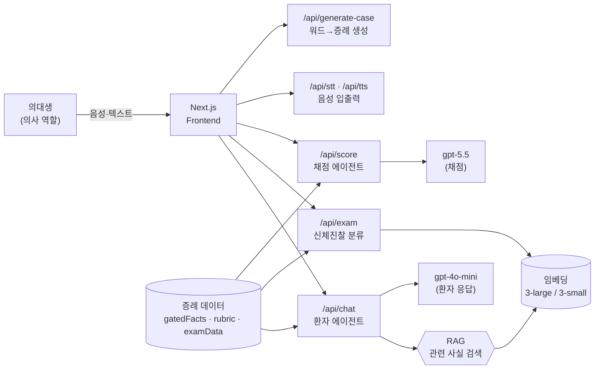

<div align="center">

# 🩺 CODE Medi

### AI 표준화환자(SP)와 면담하고, 실제 CPX 채점 기준으로 즉시 피드백받는 임상수행평가 트레이너

[](https://nextjs.org/)
[](https://www.typescriptlang.org/)
[](https://platform.openai.com/)
[](https://code-medi.vercel.app)

🔗 **Live demo · [code-medi.vercel.app](https://code-medi.vercel.app)**



</div>

---

## 한눈에

의대생이 **의사 역할**로 AI 환자를 음성으로 **문진**하고 → **신체진찰**을 수행하고 → **환자교육**까지 마친 뒤,
실제 **CPX(임상수행평가) 채점표** 기준으로 **항목별 점수 + 놓친 부분 피드백**을 즉시 받습니다.
사람 표준화환자·채점관 없이, 혼자서 실전처럼 반복 연습할 수 있는 것이 목표입니다.

```
문진(음성 면담)  →  신체진찰(부위별 영상·소견)  →  환자교육  →  자동 채점 + 피드백
```

## ✨ 주요 기능

- 🎙️ **음성 면담** — 실시간 STT/TTS로 말로 문진. 환자는 감정·말투를 가진 표준화환자로 연기하며, **묻지 않은 정보는 먼저 흘리지 않고** 진단명도 먼저 말하지 않습니다.
- 🩻 **3단계 임상 플로우** — 문진 → 신체진찰(손가락 촉진·눈 검사 등 부위별 영상 + 진단에 맞는 소견) → 환자교육.
- 📊 **자동 채점** — 문진·신체진찰·종합 점수(모두 **100점 환산**) + 교육 피드백(다룬 항목 ✓ / 놓친 항목 ✗) + 의사 발화별 코멘트.
- ⏱️ **단계별 타이머** — 단계가 넘어가도 이어지는 시간 막대, 최종 피드백에 단계별 소요시간 표시.
- 📄 **워드 채점표 업로드 → 증례 자동 생성** — `.docx` 채점표를 올리면 그에 맞는 표준화환자 증례가 즉석에서 생성됩니다.
- 🧠 **Retrieval-gated SP (RAG)** — 매 발화마다 의미적으로 가까운 사실만 검색해 주입 → 정보 누출 차단 + 증례 지식량과 무관한 일정 프롬프트. ([↓ 기술 하이라이트](#-기술-하이라이트--retrieval-gated-sp))

## 📸 스크린샷

|  음성 문진 (실시간 비주얼라이저) | 신체진찰 — 손가락 관절 촉진 |
| :---: | :---: |
|  |  |
| **신체진찰 — 눈(결막) 검사** | **채점 결과 — 점수·피드백·타이머** |
|  |  |

> 채점 화면에는 좌측 **대화 내역(문진↔신체진찰↔교육이 시간순으로)**, 우상단 **단계별 소요시간 막대**, **문진/신체진찰/종합 점수(100점 환산)**, **교육 피드백**이 함께 표시됩니다.

## 🏗️ 아키텍처



**설계 원칙 — 증례(데이터)와 코드(동작)의 분리.** 프롬프트·UI·채점 로직은 타입만 알고 동작하며, 실제 증례 내용은 `backend/cases/`의 데이터 파일(또는 업로드된 워드)에서만 옵니다. 그래서 데이터만 갈아끼우면 새 주제로 즉시 동작합니다.

## 🧠 기술 하이라이트 · Retrieval-gated SP

작은 모델(gpt-4o-mini)이 매 턴 **증례의 모든 사실 + 규칙**을 한꺼번에 받으면 지시 준수가 흔들립니다. 그래서 **사실(facts)은 검색해서 그때그때 관련된 것만**, **규칙은 항상** 주입하도록 분리했습니다.

검색 품질은 감이 아니라 **골드 평가셋 측정 기반**으로 튜닝했습니다:

| 단계 | 기법 | Recall | Hit@1 | OOD 누출 |
| --- | --- | :---: | :---: | :---: |
| 초기 | triggerHint만 임베딩 (small) | 64% | 56% | 0% |
| 개선 | + 멀티필드(질문+답변) 임베딩 | 76% | 64% | 0% |
| **최종** | **+ 한글 어휘 하이브리드 + 2단계 게이트 + 임베딩 large** | **96%** | **92%** | **0%** |

**확장 효과** — 주입 프롬프트가 증례 사실 수 N과 무관하게 일정(O(1)):

| 증례 사실 수 | naive(전체 주입) | RAG(top-k 고정) | 절감 |
| :---: | :---: | :---: | :---: |
| 24 | 6,332 tok | 4,601 tok | 1.4× |
| 100 | 14,138 tok | 4,601 tok | 3.1× |
| **1000** | **107,384 tok** | **4,601 tok** | **23.3×** |

> 재현: `npx tsx scripts/rag-eval.ts` (품질 평가) · `npx tsx scripts/rag-demo.ts` (확장 효과)
> 부수 효과: 안 물어본 사실은 컨텍스트에 **부재** → 정보 누출이 구조적으로 차단됩니다.

## 🛠️ 기술 스택

- **Frontend** — Next.js 15 (App Router), React, TypeScript, Tailwind CSS v4
- **AI** — Vercel AI SDK(`ai`) + `@ai-sdk/openai`, `zod`(structured output)
  - `gpt-4o-mini` 환자 응답 · `gpt-5.5` 채점 · `gpt-4o-transcribe` STT · `gpt-4o-mini-tts` TTS
  - `text-embedding-3-large` 사실 검색(RAG) · `text-embedding-3-small` 신체진찰 분류 게이트
- **문서 파싱** — `mammoth` (워드 `.docx` → 증례 생성)
- **배포** — Vercel

## 🚀 실행

```bash
npm install
cp .env.example .env.local      # OPENAI_API_KEY 채우기
npm run dev                     # http://localhost:3000
```

`.env.local`:

```
OPENAI_API_KEY=sk-...           # 필수
# PATIENT_MODEL / SCORING_MODEL / FACT_EMBEDDING_MODEL ... (선택, 미설정 시 기본값)
```

provider·모델명은 `backend/models.ts` 한 곳에서 교체합니다.

## 📁 폴더 구조

```
app/
  page.tsx                  # 랜딩
  session/page.tsx          # 면담 화면
  api/chat/route.ts         # 환자 에이전트 (RAG 사실검색 → 스트리밍)
  api/exam/route.ts         # 신체진찰 분류 (임베딩 게이트 + 구조화 출력)
  api/score/route.ts        # 채점 에이전트 (문진 + 신체진찰 점수)
  api/stt|tts/route.ts      # 음성 입출력
  api/generate-case/route.ts# 워드 채점표 → 증례 생성
frontend/components/        # Chat · PhysicalExam · ScoreReport · TimerBar · VoiceVisualizer ...
backend/
  models.ts                 # provider/모델 상수
  cases/                    # 증례·채점표 데이터(case-*.ts) + 타입 + 신체진찰 데이터
  patient/prompt.ts         # PatientCase → 환자 시스템 프롬프트
  patient/factRetrieval.ts  # RAG 사실 검색(멀티필드 + 하이브리드 + 2단계 게이트)
  scoring/                  # 채점 프롬프트 + 안전 JSON 파싱
  generate/casegen.ts       # 워드 채점표 → PatientCase 생성
scripts/                    # rag-eval.ts(품질 평가) · rag-demo.ts(확장 효과)
```

---

<div align="center">
<sub>by team <b>patientpatient</b> · CPX virtual patient trainer</sub>
</div>
